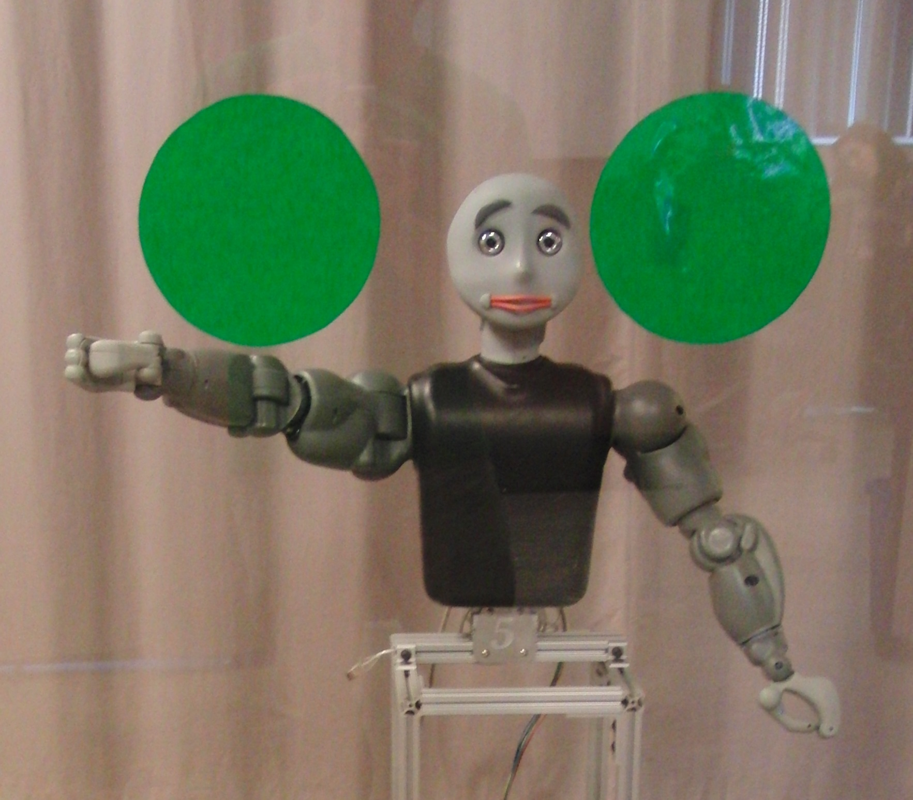

Developed in summer 2010 during an NSF research fellowship under the direction of Aaron St. Clair and Maja Mataric.

Modeled the human perception of robotic deictic gestures—multi-modal nonverbal communication—with salient objects to explore human-robot interaction. Utilized ROS to handle an experiment involving the Bandit II robot, marker pointers, SICK-LMS laser range finder, overhead and forward-facing cameras, head tracking, Wiimote controller, OpenCV, ARToolkit+. Ran experiments on 15+ human test subjects.
 